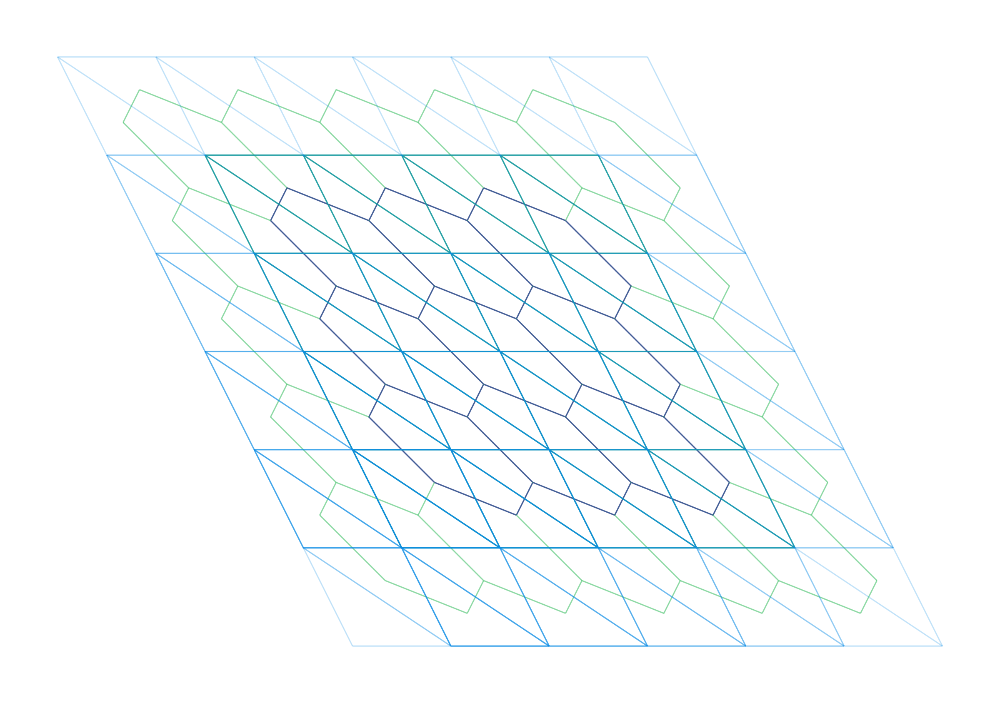

## Figures

See the [figures](figures) directory for the figures generated in the [examples](examples) directory. Some of the figures below:

### Figure 1: Dodecagon

### Figure 2: Quadrilateral

### Figure 3: Triangle

### Figure 4: Xiaowei's Tiling

